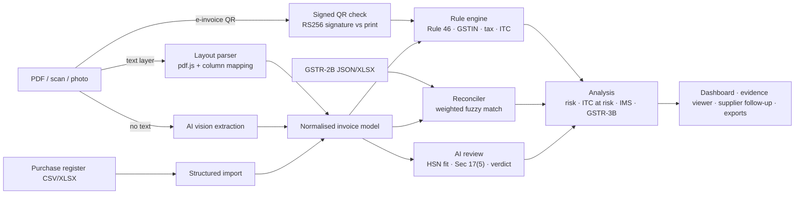

# Parakh — GST invoice assurance

**Parakh** means to test: every bill, tested before you trust it. Parakh checks purchase invoices before you claim input tax credit (ITC). It reads invoices (PDF, scans, photos, Tally/Zoho registers), validates them against GST law, reconciles them with GSTR-2B, and tells you in rupees how much credit is at risk and what to do about it: which IMS button to press, what to report in GSTR-3B, and what to ask each supplier.

> Problem statement (Vriddhi / FinTech): *Check invoices and GST data for missing fields and mismatches.*
> MVP scope covered: invoice upload · GSTIN validation · mismatch detection · risk checklist · report — plus AI extraction, GSTR-2B reconciliation, IMS actions and a GSTR-3B Table 4 draft.

## Why this matters

An Indian MSME claims ITC on hundreds of invoices a month. Credit is lost when an invoice is missing a mandatory field, the supplier charged the wrong tax head, the supplier never reported it, the GSTIN was cancelled, or the item is blocked under Sec 17(5). Each of these is found today by an accountant comparing PDFs with Excel downloads by hand, usually after the 14th, when IMS decisions are already locked in.

## What it checks

| Area | Checks | Law |
|---|---|---|
| Invoice particulars | number (≤16 chars, allowed characters), date, supplier name/address, recipient GSTIN, HSN/SAC, signature, place of supply | Rule 46 |
| GSTIN | format, **base-36 checksum**, state code, PAN entity type, PAN–name initial, registration status (cancelled/suspended), new-registration fraud signal | Rule 46(a), Sec 16(2)(c) |
| Tax computation | qty × rate, rate × taxable, CGST = SGST, line and grand totals, round-off | Sec 15 |
| Tax head | IGST vs CGST+SGST from supplier state and place of supply | Sec 7/8 IGST Act, Sec 77 |
| Place of supply | POS outside the recipient's state ⇒ ITC ineligible | Sec 16(2)(b) |
| Rates | valid slabs; **GST 2.0 (22 Sep 2025)** legacy 12%/28% detection; HSN reference rates; overcharge in ₹ | Notf. 9/2025-CT(R) |
| ITC eligibility | Sec 17(5) blocked credit, Sec 16(4) time limit, 180-day payment rule | Sec 16, 17(5), Rule 37 |
| E-invoicing | missing IRN from mandated suppliers, IRN format | Rule 48(4)/(5) |
| Fraud signals | exact and near duplicates, unknown suppliers filing against your GSTIN | — |
| GSTR-2B | weighted fuzzy matching (invoice no. canonicalisation, Jaro-Winkler, GSTIN typo tolerance, date/value windows) → matched / probable / mismatch / not in 2B / not in books | Sec 16(2)(aa) |

Every finding carries a severity, a rupee **ITC-at-risk** figure, the legal citation and a concrete fix. Per invoice, Parakh computes a 0–100 risk score and a recommended **IMS action** (accept / pending / reject). For the period it drafts **GSTR-3B Table 4** and scores every supplier.

## Built for people who don't know GST

Most people who handle purchase bills in a small business are not tax experts. Parakh opens in **Simple mode**:

- **A 30-second "start here" story** with a diagram: supplier → bill → you, supplier → GST portal → your GSTR-2B, and where Parakh checks.
- **Plain-English findings.** Every issue answers *what is wrong*, *why it matters to me*, and *what do I do now*, with the rupees at stake. Legal detail is one line below for the accountant.
- **Three verdicts instead of risk scores:** *Safe to claim*, *Check first*, *Don't claim yet*. Issues are either *Must fix* or *Good to fix*.
- **Tap-to-explain terms.** Every GST word (ITC, GSTIN, GSTR-2B, IMS, place of supply…) is underlined; hover or tap for a one-line meaning, why it matters, and an example.
- **This month's deadlines** as a timeline with "you are here".
- **Learn GST** page: a 2-minute primer, a calculator that shows how much extra tax a faulty bill costs you, CGST+SGST vs IGST explained visually, a GST rate finder, and a glossary.
- **A 60-second guided tour** of the whole product.

**Expert mode** switches to citations, rule IDs, risk scores and practitioner terms for CAs.

## Signed e-invoice QR verification

E-invoices carry a QR code holding a JWT signed (RS256) by the Invoice Registration Portal. Parakh decodes the QR from the PDF or photo (jsQR), verifies the signature with WebCrypto, and compares the signed seller/buyer GSTIN, invoice number, date and total with what is printed. A PDF edited after registration is caught, and only the registered value is treated as claimable. The demo signs its sample e-invoices with a demo key (`src/einvoice/demoIrpKey.json`); production adds the IRP's published public keys.

## Human review and measured reliability

- Any bill read by AI, or parsed with under 80% confidence, is routed to a person: *Details are correct* or *Fix details* (edits re-run every check and are recorded in the audit trail).
- The **Reliability** page measures Parakh against the sample pack's answer key: field-level extraction accuracy (unread documents count as wrong), planted problems caught, extra flags raised, time per document, and known limits.
- Exports carry an audit trail: generation time and the inputs behind every figure.

## Where AI is used (and where it is not)

Deterministic rules decide anything with a legal answer, so results are explainable and reproducible. AI covers what rules cannot:

1. **Document understanding** — scanned and photographed invoices are read by a vision model into the same structured schema (text-layer PDFs are parsed on-device, with field coordinates so findings are highlighted on the page).
2. **Semantic review** — does the HSN fit the description? Is this purchase blocked under Sec 17(5) *for this business*? One batched call checks every line in the period.
3. **Explanation and action** — a plain-language verdict (English, Telugu or Hindi) and a ready-to-send email/WhatsApp to the supplier listing exactly what to correct.

Providers: **Claude** when the app runs inside claude.ai (no key needed), or **Gemini** with your own key when self-hosted. Without AI, everything except scan reading still works.

## Architecture



```
src/
  domain/      types, GSTIN, rules, reconciliation, scoring (pure TypeScript, no UI)
  ingest/      pdf.js text + rendering, layout parser, CSV/XLSX/2B readers
  einvoice/    e-invoice QR decoding and signature verification
  ai/          provider chain (Claude / hosted Parakh AI / Gemini / labelled fallbacks) and AI tasks
  export/      Excel workbook, CSV, HTML audit report
  ui/          React app: overview, invoices, evidence viewer, reconciliation, suppliers, filing, learn
  ui/onboarding/  animated intro, role-based welcome, missions, page hints
api/
  ai.js        Vercel serverless AI proxy; the key stays on the server
scripts/
  generate_samples.py   builds the demo pack (16 invoices with planted issues, GSTR-2B, register)
  smoke.ts              runs the engine on the demo pack in Node and prints every finding
```

All processing happens in the browser; only documents the user chooses to send to AI leave the page.

## AI for judges (no account needed)

Host on Vercel with your team's key in `GEMINI_API_KEY` or `ANTHROPIC_API_KEY`; the app calls `api/ai.js`, so every visitor gets AI with no setup. If no AI is reachable, every AI button falls back to a labelled rule-based answer. Steps: [DEPLOY.md](DEPLOY.md).

## Run it

```bash
npm install
npm run dev            # http://localhost:5173 — opens on the sample workspace
npm run smoke          # engine test on the sample pack (Node)
npm run build          # production build in dist/
npm run build:single   # one self-contained HTML file in dist-single/
```

For AI outside claude.ai: Settings → paste a Gemini API key (free from Google AI Studio). It is stored only in the browser.

Regenerate the sample pack: `pip install reportlab pymupdf pillow && npm run samples`.

## Sample workspace

*Sri Venkateswara Precision Components Pvt Ltd*, Hanamkonda (GSTIN 36AAKCS4821M1ZX), September 2026, checked on 09 Oct 2026, 5 days before IMS closes. It contains 16 supplier documents (two of them signed e-invoices, one edited after signing) and 15 register rows, each planted with a real-world problem: IGST on an intra-state supply, a GSTIN typo, a supplier who has not filed, a GSTR-2B value mismatch, a reformatted invoice number, an AC still billed at 28%, a staff-lunch catering bill, an invoice without your GSTIN, a duplicate scan, a cancelled supplier, a Karnataka place of supply, arithmetic errors, a scanned e-invoice without IRN, a time-barred FY 2024-25 invoice, a supplier unpaid for 234 days, and two filings against your GSTIN that are not in the books.

The supplier registry in the demo is a fixed sample. In production it is a live GSTIN search through a GST Suvidha Provider (GSP) API.

## References studied

We studied these open-source projects and took ideas, not code:

| Project | Idea we adopted |
|---|---|
| [GST Desk / Gst-Invoice-Assistant](https://github.com/Ashutosh0945/Gst-Invoice-Assistant) | "Rules compute, AI explains"; signed e-invoice QR verification; confidence-based human review |
| [Invoice Intelligence Reliability Lab](https://github.com/yuvaraj-builds-ai/Invoice-Intelligence-Reliability-Lab) | Measure accuracy against an answer key and show failures; route risky reads to a person |
| [SYJ GST Reconciliation](https://github.com/SHalimoosavi/SYJ-GST-Reconciliation) | Plain names for match groups, audit-trail metadata on reports, per-stage timing |
| [invoice-intelligence](https://github.com/kaurnarinder11/invoice-intelligence) | One simple verdict per invoice anyone can read |
| [SmartRecon-GST](https://github.com/wardayX/SmartRecon-GST) | A GST rate finder by product name or HSN |
| [GST Invoice Compliance Automation](https://github.com/Saksham1136/GST-Invoice-Compliance-Automation-System) | Errors vs warnings, compliance score per invoice |

What Parakh adds on top: ITC at risk in rupees per finding, evidence highlighted on the document, GST 2.0 rate checks, IMS actions and a GSTR-3B Table 4 draft, supplier follow-ups in Telugu/Hindi, a fully in-browser pipeline, and a beginner mode.

## Roadmap

- Live GSTIN and e-invoice (IRN/QR) verification through a GSP
- Direct GSTR-2B/IMS pull and push via GSP APIs; one-click IMS actions
- Tally/Zoho connectors; multi-GSTIN and CA practice mode (many clients, one dashboard)
- Learning from confirmed matches; supplier risk network across clients
